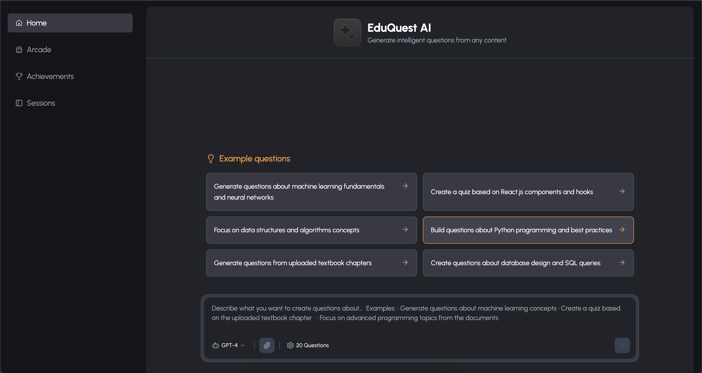

# 🚀 AI Exams : 100xEngineers Buildathon Project

▶️ [Watch Demo](https://drive.google.com/file/d/1xv40JRgDIw9uiRCjyKHJ9W2u8DMSp7FQ/view?usp=sharing)

**Welcome to AI Exams — where testing meets intelligence.**
Generate questions, simulate exams, play educational games, and level up — all in one smooth, AI-powered platform.

---

## ⚙️ Core Features

* 📄 Input: Docs, Images, Prompts
* 🧠 Auto-generate MCQs, FIBs, True/False, Short/Long Answers (JSON format)
* 🧪 Interactive Exam Mode with originality checks & AI feedback
* 🕹 Arcade Mode: Gamified challenges from past prompts
* 🏅 Progress tracking through performance-based leveling
* 🗣 Voice commands (`Shift + A`), fast navigation (`Cmd + K`), one-touch translation

---

## ⚠️ Known Issues

* Some model & translation glitches
* Non-translatable words may appear unchanged

---

## 🔧 Next Up

* 🖼 Image-based questions
* ⏲ Exam timers
* 🪲 Bug fixes & performance updates

---
## UI / Design
* All assets and images and generated with Chatgpt and Designed in Figma.
  
**AI Exams — Assess better. Learn smarter.**
